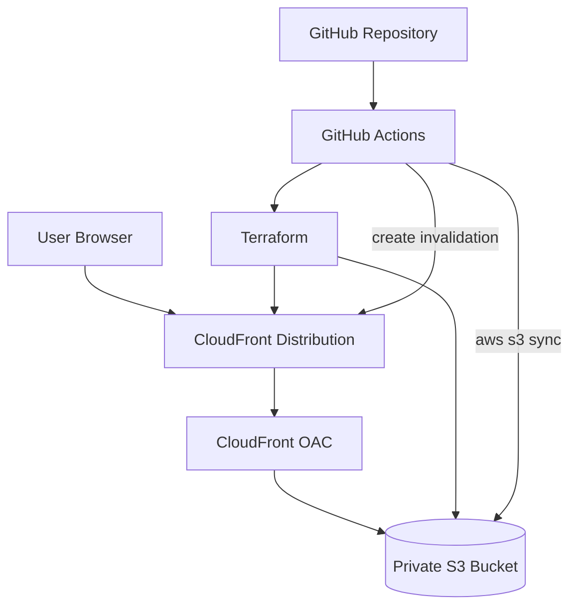

# AWS Static Site CI/CD with Terraform and GitHub Actions

Static DevOps portfolio website deployed to AWS using Terraform, S3, CloudFront, and GitHub Actions.

**User -> CloudFront -> private S3 bucket**

## Architecture



## What This Project Builds

| Component | Purpose |
|-----------|---------|
| S3 bucket | Stores static website files privately |
| S3 public access block | Prevents direct public access to the bucket |
| S3 encryption | Encrypts objects at rest using Amazon S3 managed encryption |
| S3 versioning | Keeps object versions for safer website updates |
| CloudFront distribution | Serves the website globally over HTTPS |
| Origin Access Control | Allows CloudFront to read from private S3 securely |
| Bucket policy | Allows reads only from the CloudFront distribution |
| GitHub Actions | Validates Terraform and deploys website changes |

## Repository Layout

```text
.
├── .github/workflows/
│   ├── devsecops.yml
│   ├── terraform-checks.yml
│   └── terraform-deploy.yml
├── terraform/
│   ├── modules/
│   │   ├── cdn/
│   │   └── storage/
│   ├── backend.tf
│   ├── main.tf
│   ├── outputs.tf
│   ├── providers.tf
│   ├── terraform.tfvars.example
│   └── variables.tf
└── website/
    ├── error.html
    └── index.html
```

## Terraform Modules

### `modules/storage`

Creates the S3 storage layer:

- Private S3 bucket
- Public access block
- Server-side encryption
- Versioning
- Bucket outputs used by CloudFront and CI/CD

### `modules/cdn`

Creates the delivery layer:

- CloudFront Origin Access Control
- CloudFront distribution
- HTTPS redirect behavior
- Custom 403/404 error responses
- Bucket policy allowing CloudFront-only reads

## CI/CD

### Pull Request Checks

`.github/workflows/terraform-checks.yml` runs on pull requests to `main`:

- `terraform fmt -check -recursive`
- `terraform init -backend=false`
- `terraform validate`

### DevSecOps Scans

`.github/workflows/devsecops.yml` runs on pull requests and pushes to `main`:

- Gitleaks secret scanning
- Checkov Terraform scanning

Some Checkov rules are intentionally skipped in `.checkov.yml` because this is a lab portfolio project where cost and easy teardown matter. Production trade-offs are documented there.

### Deploy

`.github/workflows/terraform-deploy.yml` runs on push to `main` or manually through `workflow_dispatch`:

1. Checks Terraform formatting.
2. Initializes Terraform with the remote backend.
3. Validates Terraform.
4. Creates a Terraform plan.
5. Applies the plan.
6. Syncs `website/` files to S3.
7. Invalidates the CloudFront cache.

## Prerequisites

- Terraform >= 1.5
- AWS account
- S3 bucket for Terraform remote state
- GitHub repository secrets:
  - `AWS_ACCESS_KEY`
  - `AWS_SECRET_ACCESS_KEY`

For production, GitHub OIDC with an IAM role is preferred over long-lived access keys.

## Local Usage

```bash
cd terraform
cp terraform.tfvars.example terraform.tfvars
terraform init
terraform fmt -recursive
terraform validate
terraform plan
terraform apply
```

After apply, get the CloudFront URL:

```bash
terraform output cloudfront_url
```

Upload website files manually if needed:

```bash
aws s3 sync ../website/ "s3://$(terraform output -raw website_bucket_name)" --delete
aws cloudfront create-invalidation \
  --distribution-id "$(terraform output -raw cloudfront_distribution_id)" \
  --paths "/*"
```

## Teardown

Destroy the lab resources when finished to avoid ongoing charges:

```bash
cd terraform
terraform destroy
```

The S3 bucket has `force_destroy = true` by default so Terraform can delete the bucket even if website files exist.

## Security Notes

- The S3 bucket is not public.
- CloudFront uses Origin Access Control to access S3.
- Bucket policy allows `s3:GetObject` only from the CloudFront distribution.
- Viewer traffic is redirected to HTTPS.
- S3 objects are encrypted at rest.
- Gitleaks and Checkov run in CI.

## Interview Talking Points

- Why CloudFront should sit in front of S3 instead of making the bucket public.
- How Origin Access Control improves on public bucket hosting.
- How GitHub Actions separates PR validation from deployment.
- Why cache invalidation is needed after uploading changed static files.
- What trade-offs are acceptable for a lab project but should change in production.

## Future Production Improvements

- Use GitHub OIDC and IAM role assumption instead of long-lived AWS keys.
- Add a custom domain with Route 53 and ACM.
- Add CloudFront access logging.
- Add WAF if the site requires stronger edge protection.
- Add a separate environment strategy for dev and production.
